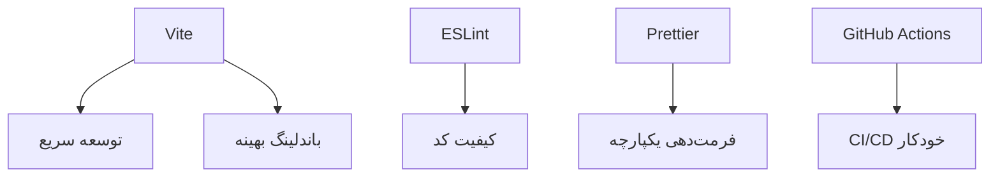
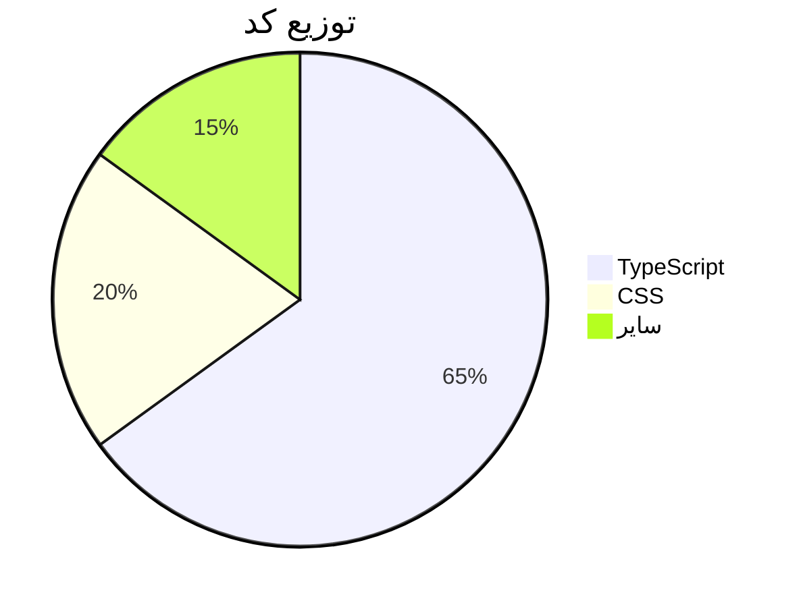

# 🌦 پروژه هواشناسی پیشرفته (React + TypeScript)

یک اپلیکیشن جامع و مدرن برای نمایش و پیش‌بینی وضعیت آب و هوا

## ✨ ویژگی‌های منحصر به فرد

### 🌍 نمایش اطلاعات هواشناسی
- پیش‌بینی دقیق به تفکیک **ساعتی** و **روزانه** (تا 5 روز آینده)
- نمایش **گرافیکی** تغییرات دما، رطوبت و فشار هوا
- اطلاعات تکمیلی شامل:
  - 💨 سرعت و جهت باد
  - ☀️ شاخص UV
  - 🌅 زمان طلوع و غروب خورشید
  - 🌫 دید افقی

### 🎛 قابلیت‌های کاربردی
- جستجوی **هوشمند** شهرها با قابلیت پیشنهاد خودکار
- سیستم **مدیریت شهرهای مورد علاقه** (حفظ در localStorage)
- **تم تاریک/روشن** با تشخیص خودکار سیستم عامل
- نمایش **نقشه تعاملی** موقعیت جغرافیایی
- بهینه‌شده برای **موبایل** و **دسکتاپ**

## 🛠 فناوری‌های استفاده شده

### Frontend
| تکنولوژی | کاربرد |
|----------|--------|
| React 18 | چارچوب اصلی |
| TypeScript | نوع‌بندی ایمن کد |
| Tailwind CSS | استایل‌دهی مدرن |
| Framer Motion | انیمیشن‌های تعاملی |

### مدیریت حالت
| کتابخانه | کاربرد |
|----------|--------|
| Zustand | مدیریت حالت جهانی |
| TanStack Query | مدیریت داده‌های API |

### ابزارها


## 🚀 نحوه راه‌اندازی

1. کلون پروژه:
```bash
git clone https://github.com/Amir-Ali-Dev/weather-app.git
```

2. نصب وابستگی‌ها:
```bash
cd weather-app
npm install
```

3. اجرای محیط توسعه:
```bash
npm run dev
```

4. ساخت نسخه تولید:
```bash
npm run build
```

## 🌐 لینک‌های مفید

- 🔍 [دموی زنده](https://weather.amirali-dev.com/)
- 📝 [مستندات فنی](https://github.com/Amir-Ali-Dev/weather-app/wiki)
- 🐛 [گزارش مشکل](https://github.com/Amir-Ali-Dev/weather-app/issues)

## 🤝 مشارکت در پروژه

پروژه با مجوز **MIT** منتشر شده و مشارکت‌های شما شامل:
- گزارش باگ‌ها
- پیشنهاد ویژگی‌های جدید
- ارسال Pull Request



## 📊 آمار پروژه


